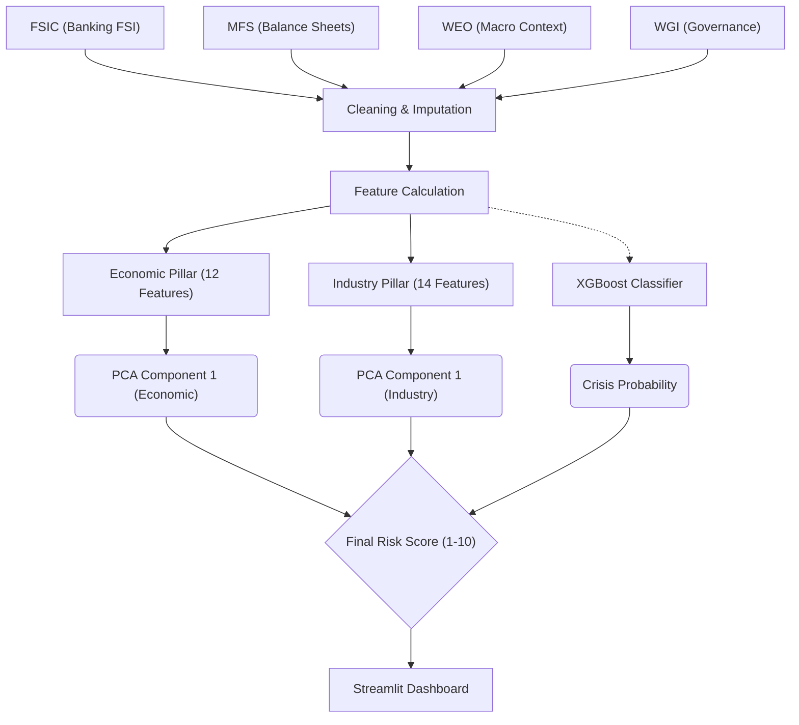
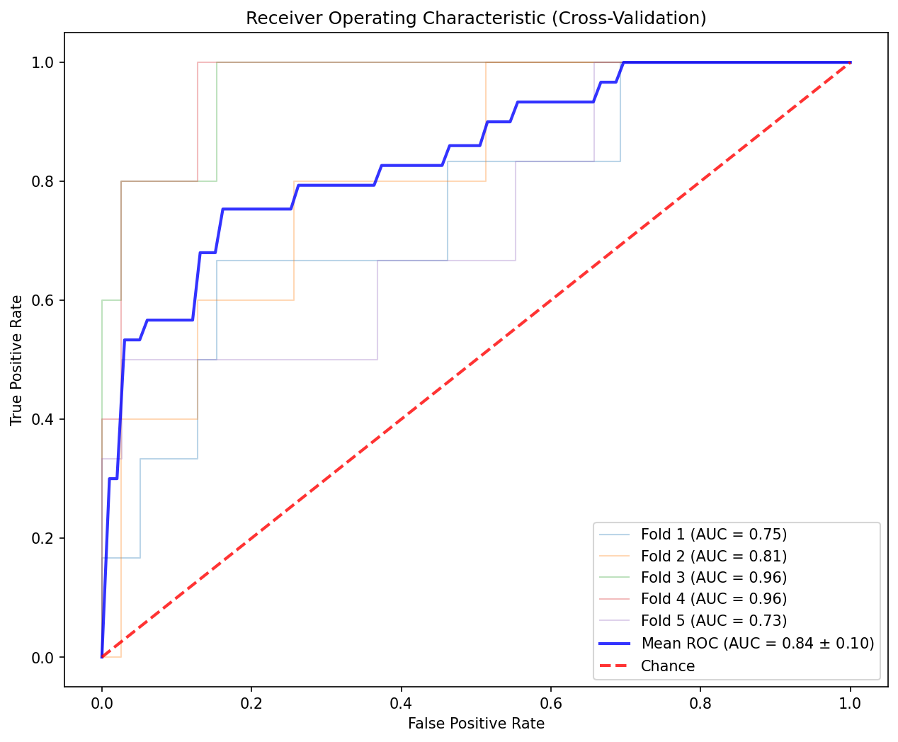
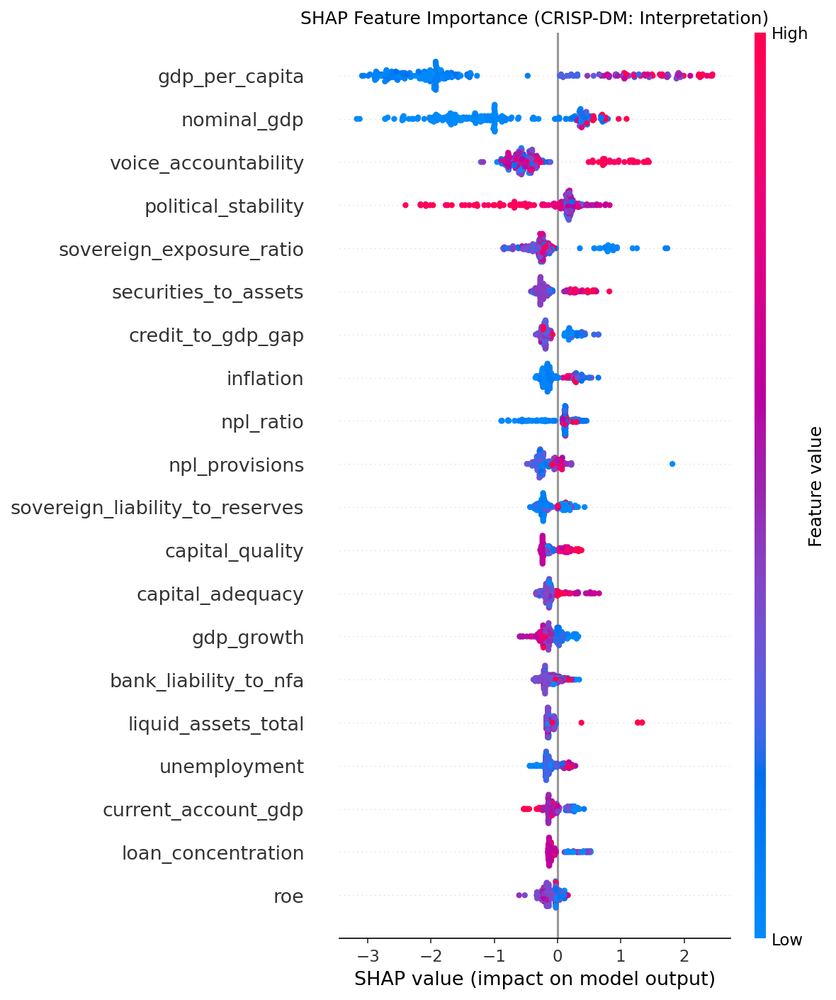

# Methodology
## Banking System Stability Model

### Overview
This package provides everything needed to replicate and validate the Banking Risk Model.

### Data Flow & Process Architecture


### Data Sources
| Source | Records | Countries | Description |
|--------|---------|-----------|-------------|
| FSIC | 859,227 | 155 | IMF Financial Soundness Indicators |
| WEO | 354,240 | 208 | IMF World Economic Outlook |
| MFS | 1,326,510 | 178 | IMF Monetary & Financial Statistics |
| FSIBSIS | 25,636 | 111 | IMF Balance Sheet Data |
| WGI | 5,481 | 216 | World Bank Governance Indicators |
| **TOTAL** | **2,571,094** | **-** | **-** |

### Features Used in Model (33 After Correlation Filtering)

To ensure model stability, we filtered out highly correlated features (r > 0.85). Below is the availability of each feature across the 235 observed jurisdictions.

#### Economic Pillar (12 Features)
| Feature | Coverage % | Source | Description | Literature Justification |
|---------|------------|--------|-------------|--------------------------|
| gdp_per_capita | 84% (197) | WEO | GDP per capita USD (anchor) | Institutional resilience (S&P BICRA) |
| gdp_growth | 89% (208) | WEO | Real GDP growth % | Economic resilience (Kaminsky & Reinhart, 1999) |
| inflation | 89% (208) | WEO | Consumer price inflation % | Macro stability (Demirgüç-Kunt & Detragiache, 1998) |
| unemployment | 51% (121) | WEO | Unemployment rate % | Household debt capacity (IMF FSI) |
| nominal_gdp | 89% (208) | WEO | Nominal GDP (local currency) | System size anchor (BIS) |
| current_account_gdp | 88% (206) | WEO | Current account % GDP | External vulnerability (Frankel & Saravelos, 2012) |
| govt_debt_gdp | 87% (204) | WEO | Government debt % GDP | Sovereign fiscal space (Acharya et al., 2014) |
| fiscal_balance_gdp | 88% (207) | WEO | Fiscal balance % GDP | Fiscal trajectory (Laeven & Valencia, 2018) |
| credit_to_gdp_gap | 66% (156) | MFS | BIS credit gap methodology | Early warning indicator (Drehmann et al., 2010) |
| voice_accountability | 92% (216) | WGI | Voice & Accountability (0-100) | Institutional quality (Acemoglu et al., 2005) |
| political_stability | 92% (216) | WGI | Political Stability (0-100) | Political risk premium (Diamonte et al., 1996) |
| sovereign_liability_to_reserves | 75% (177) | MFS | Sovereign Ext Liab / Reserves | **Currency Mismatch** (Inability to borrow in local currency) |

#### Industry Pillar (14 Features)
| Feature | Coverage % | Source | Description | Literature Justification |
|---------|------------|--------|-------------|--------------------------|
| capital_adequacy | 66% (154) | FSIC | Regulatory capital / RWA % | Loss absorption (Basel III / Admati et al., 2013) |
| capital_quality | 66% (154) | FSIC | Tier1/CAR ratio % | Quality of capital buffer (Basel III) |
| npl_ratio | 66% (155) | FSIC | NPL / Gross loans % | Asset quality signal (Reinhart & Rogoff, 2011) |
| npl_provisions | 65% (153) | FSIC | Provisions / NPL % | Loss coverage (Borio et al., 2001) |
| roe | 65% (153) | FSIC | Return on equity % | Profitability (ECB) |
| roa | 66% (154) | FSIC | Return on assets % | Efficiency (ECB) |
| liquid_assets_st_liab | 66% (154) | FSIC | Liquid assets / ST liabilities | ST liquidity (LCR / Diamond-Dybvig) |
| liquid_assets_total | 66% (154) | FSIC | Liquid assets / Total | Overall liquidity (IMF FSI) |
| customer_deposits_loans | 65% (152) | FSIC | Deposits / Loans % | Funding stability (Shin, 2009) |
| fx_loan_exposure | 60% (141) | FSIC | FX loans % of total | Currency mismatch (Ranciere et al., 2010) |
| loan_concentration | 31% (72) | FSIC | Loan concentration % | Diversification risk (HHI) |
| real_estate_loans | 56% (132) | FSIC | Real estate loans % | RE boom/bust (S&P BICRA / Crowe et al., 2013) |
| sovereign_exposure_ratio | 69% (161) | MFS | Bank claims on govt % | Sovereign-Bank Nexus (Acharya et al., 2014) |
| bank_liability_to_nfa | 75% (177) | MFS | Bank Ext Liab / Net For Assets | Banking FX Leverage (MFS ODCORP) |

### Feature Correlations

*Figure 1: Feature Correlation Matrix. The clean block diagonal structure confirms that Economic and Industry pillars capture distinct structural dimensions of risk.*

---

### Feature Engineering & Preprocessing

1.  **Imputation**: Missing values are imputed using `KNNImputer` (k=5) to preserve local data structures, with a median fallback for sparse features.
2.  **Transformations**:
    *   **Log Transform**: Applied to highly skewed features (`gdp_per_capita`, `nominal_gdp`) to normalize distributions.
    *   **Clipping**: Extreme outliers (e.g., inflation > 100%, negative equity) are clipped to valid ranges.
3.  **Scaling**:
    *   **StandardScaler**: Used for PCA (Pillars) to ensure zero mean and unit variance, preventing large-scale features (like GDP) from dominating.
    *   **MinMaxScaler**: Used for final score aggregation to bound Risk Scores between 1-10.

### Model Architecture & Validation

The model employs a **Hybrid Architecture** combining unsupervised structure with supervised calibration.

#### 1. Unsupervised Pillars (PCA)
*   **Technique**: Principal Component Analysis (PCA) reduces high-dimensional data into single "Risk Factors".
*   **Weighting**: The First Principal Component (PC1) is extracted for each pillar.
*   **Significance**: Economic PC1 explains **87%** of variance; Industry PC1 explains **72%**.

#### 2. Supervised Crisis Classifier (XGBoost)
*   **Algorithm**: XGBoost (Gradient Boosted Trees) trained on the Laeven-Valencia Systemic Banking Crisis dataset.
*   **Objective**: Predict crisis probability (0-1) over a 3-year horizon.
*   **Validation**:
    *   **5-Fold Stratified Cross-Validation** to prevent overfitting on small crisis samples (n=27).
    *   **Metric**: Area Under ROC Curve (AUC).

#### Validation Results
| Metric | Score | Interpretation |
|--------|-------|----------------|
| **Mean CV AUC** | **0.840** | Strong predictive power (Baseline: 0.70) |
| Std Dev | ±0.185 | Moderate variance due to small sample size |
| Training AUC | 1.000 | Expected (High capacity model) |


*Figure 2: 5-Fold CV ROC Curve. The model maintains high sensitivity without excessive false alarms.*


#### Feature Importance
Which factors drive the crisis prediction?


*Figure 3: SHAP Value Summary. `gdp_per_capita` and `nominal_gdp` act as primary **institutional capacity anchors** (reflecting the "Deep Pockets" theory). Notably, the new `sovereign_liability_to_reserves` matches the **"Original Sin" hypothesis** (risks from borrowing in foreign currency).*

### Score Interpretation
| Score | Category | Countries |
|-------|----------|-----------|
| 1-2 | Very Low Risk | NOR, FIN, AUS, CHE, LUX, CAN |
| 3-4 | Low Risk | DEU, GBR, FRA, USA, JPN |
| 5-6 | Moderate Risk | CHN, IDN, IND |
| 7-8 | High Risk | KEN, VEN, TUR |
| 9-10 | Very High Risk | NGA, UKR, PAK |

### Replication
```bash
pip install -r requirements.txt
# Place IMF CSV files in project root
python train_model.py
streamlit run app.py
python replication/scripts/generate_outputs.py
```

### Outputs
| File | Content |
|------|---------|
| outputs/model_scores.csv | Risk scores for 212 countries |
| outputs/feature_matrix.csv | 234 countries × 40 features |
| outputs/pca_loadings.json | PCA component weights |
| sample_data/ | 1000-row samples from each dataset |

### References
*   BIS (2010): Credit-to-GDP gap methodology
*   Laeven & Valencia (2018): Crisis definitions
*   S&P BICRA: Two-pillar framework
