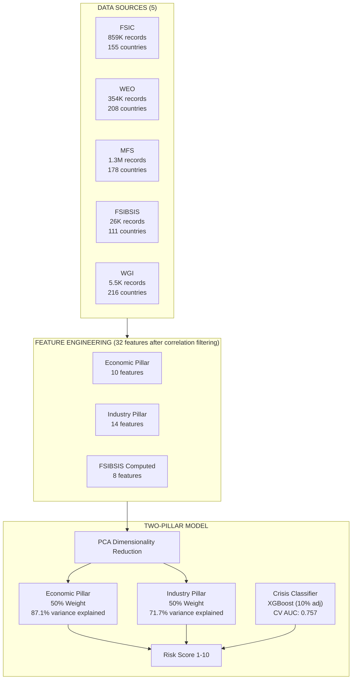

# Banking System Stability Model - Replication Package

## Overview
This package provides everything needed to replicate and validate the Banking Risk Model.

---

## Data Flow & Process Architecture



---

## Data Sources

| Source | Records | Countries | Description |
|--------|---------|-----------|-------------|
| **FSIC** | 859,227 | 155 | IMF Financial Soundness Indicators |
| **WEO** | 354,240 | 208 | IMF World Economic Outlook |
| **MFS** | 1,326,510 | 178 | IMF Monetary & Financial Statistics |
| **FSIBSIS** | 25,636 | 111 | IMF Balance Sheet Data |
| **WGI** | 5,481 | 216 | World Bank Governance Indicators |
| **TOTAL** | 2,571,094 | - | - |

---

## Features Used in Model (31 After Correlation Filtering)

> **Note**: 8 features are dropped due to high correlation (r > 0.85):
> `tier1_capital`, `credit_to_gdp`, `private_credit_to_gdp`, `total_credit_to_gdp`,
> `govt_effectiveness`, `regulatory_quality`, `rule_of_law`, `control_corruption`

### Economic Pillar (11 Features)

| Feature | Coverage | Source | Description | Literature Justification |
|---------|----------|--------|-------------|--------------------------|
| `gdp_per_capita` | 197 | WEO | GDP per capita USD (anchor) | Proxy for institutional resilience (S&P BICRA) |
| `gdp_growth` | 208 | WEO | Real GDP growth % | Economic resilience to shocks (Kaminsky & Reinhart, 1999) |
| `inflation` | 208 | WEO | Consumer price inflation % | Macroeconomic stability proxy (Demirgüç-Kunt & Detragiache, 1998) |
| `unemployment` | 121 | WEO | Unemployment rate % | Household debt servicing capacity indicator (IMF FSI) |
| `nominal_gdp` | 208 | WEO | Nominal GDP (local currency) | System size anchor for economic resilience (BIS) |
| `current_account_gdp` | 206 | WEO | Current account % GDP | External vulnerability/sudden stop risk (Frankel & Saravelos, 2012) |
| `govt_debt_gdp` | 204 | WEO | Government debt % GDP | Sovereign fiscal space to backstop banks (Acharya et al., 2014) |
| `fiscal_balance_gdp` | 207 | WEO | Fiscal balance % GDP | Recent fiscal trajectory (Laeven & Valencia, 2018) |
| `credit_to_gdp_gap` | 156 | MFS | BIS credit gap methodology | Primary early warning indicator for banking crises (Drehmann et al., 2010) |
| `voice_accountability` | 216 | WGI | Voice & Accountability (0-100) | Institutional quality/transparency (Acemoglu et al., 2005) |
| `political_stability` | 216 | WGI | Political Stability (0-100) | Political risk premium/capital flight risk (Diamonte et al., 1996) |

### Industry Pillar (13 Features)

| Feature | Coverage | Source | Description | Literature Justification |
|---------|----------|--------|-------------|--------------------------|
| `capital_adequacy` | 154 | FSIC | Regulatory capital / RWA % | Loss absorption capacity (Basel III / Admati et al., 2013) |
| `capital_quality` | 154 | FSIC | Tier1/CAR ratio % | Quality of capital buffer (Basel III) |
| `npl_ratio` | 155 | FSIC | NPL / Gross loans % | Asset quality deterioration signal (Reinhart & Rogoff, 2011) |
| `npl_provisions` | 153 | FSIC | Provisions / NPL % | Coverage of realized losses (Borio et al., 2001) |
| `roe` | 153 | FSIC | Return on equity % | Profitability/Capital generation capacity (ECB) |
| `roa` | 154 | FSIC | Return on assets % | Efficiency of asset deployment (ECB) |
| `liquid_assets_st_liab` | 154 | FSIC | Liquid assets / ST liabilities % | Short-term liquidity coverage (LCR / Diamond-Dybvig) |
| `liquid_assets_total` | 154 | FSIC | Liquid assets / Total assets % | Overall liquidity buffer (IMF FSI) |
| `customer_deposits_loans` | 152 | FSIC | Customer deposits / Loans % | Funding stability/Reliance on wholesale funding (Shin, 2009) |
| `fx_loan_exposure` | 141 | FSIC | FX loans % of total | Currency mismatch/devaluation risk (Ranciere et al., 2010) |
| `loan_concentration` | 72 | FSIC | Loan concentration % | Diversification risk (HHI methodology) |
| `real_estate_loans` | 132 | FSIC | Real estate loans % | Real estate boom/bust exposure (S&P BICRA / Crowe et al., 2013) |
| `sovereign_exposure_ratio` | 161 | MFS | Bank claims on govt % | Sovereign-Bank "Doom Loop" risk (Acharya et al., 2014) |

### FSIBSIS Computed (7 Features)

| Feature | Coverage | Formula | Literature Justification |
|---------|----------|---------|--------------------------|
| `net_interest_margin` | 110 | (Int Inc - Int Exp) / Assets | Profitability efficiency (Saunders & Schumacher, 2000) |
| `interbank_funding_ratio` | 100 | Interbank Deps / Liabilities | Contagion/Wholesale funding risk (Upper, 2011) |
| `income_diversification` | 108 | Non-Int Inc / Total Income | Business model diversification (Stiroh, 2004) |
| `securities_to_assets` | 106 | Securities / Assets | Market risk/Liquidity buffer (IMF) |
| `specific_provisions_ratio` | 110 | Provisions / Loans | Forward-looking credit risk recognition (Beattie et al., 1995) |
| `large_exposure_ratio` | 76 | Large Exp / Reg Capital | Single-name concentration risk (Basel Core Principles) |
| `deposit_funding_ratio` | 110 | Deposits / Liabilities | Stable funding base stability (NSFR proxy) |

---

## Model Architecture

### Score Calculation
```
Risk Score = 0.9 × Pillar Score + 0.1 × (1 + 9 × Crisis Probability)

Pillar Score = 50% × Economic PCA (PC1) + 50% × Industry PCA (PC1)
```

### PCA Statistics
- Economic Pillar: 87.1% variance explained
- Industry Pillar: 71.7% variance explained
- Combined correlation: 0.972 (consistent)

### Crisis Classifier
- Algorithm: XGBoost
- 5-Fold CV AUC: 0.757 (±0.202)
- Top features: gdp_per_capita > nominal_gdp > capital_adequacy

### Score Interpretation

| Score | Category | Countries |
|-------|----------|-----------|
| 1-2 | Very Low Risk | NOR, FIN, AUS, CHE, LUX, CAN |
| 3-4 | Low Risk | DEU, GBR, FRA, USA, JPN |
| 5-6 | Moderate Risk | CHN, IDN, IND |
| 7-8 | High Risk | KEN, VEN, TUR |
| 9-10 | Very High Risk | NGA, UKR, PAK |

---

## Replication

1. `pip install -r requirements.txt`
2. Place IMF CSV files in project root
3. `python train_model.py`
4. `streamlit run app.py`
5. `python replication/scripts/generate_outputs.py`

---

## Outputs

| File | Content |
|------|---------|
| `outputs/model_scores.csv` | Risk scores for 212 countries |
| `outputs/feature_matrix.csv` | 234 countries × 40 features |
| `outputs/pca_loadings.json` | PCA component weights |
| `sample_data/` | 1000-row samples from each dataset |

---

## References

- BIS (2010): Credit-to-GDP gap methodology
- Laeven & Valencia (2018): Crisis definitions
- S&P BICRA: Two-pillar framework
